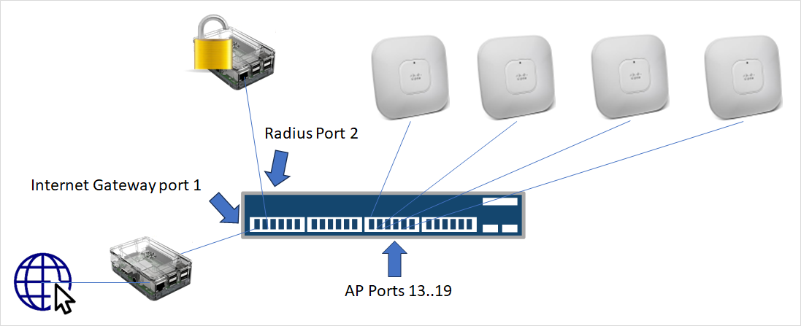
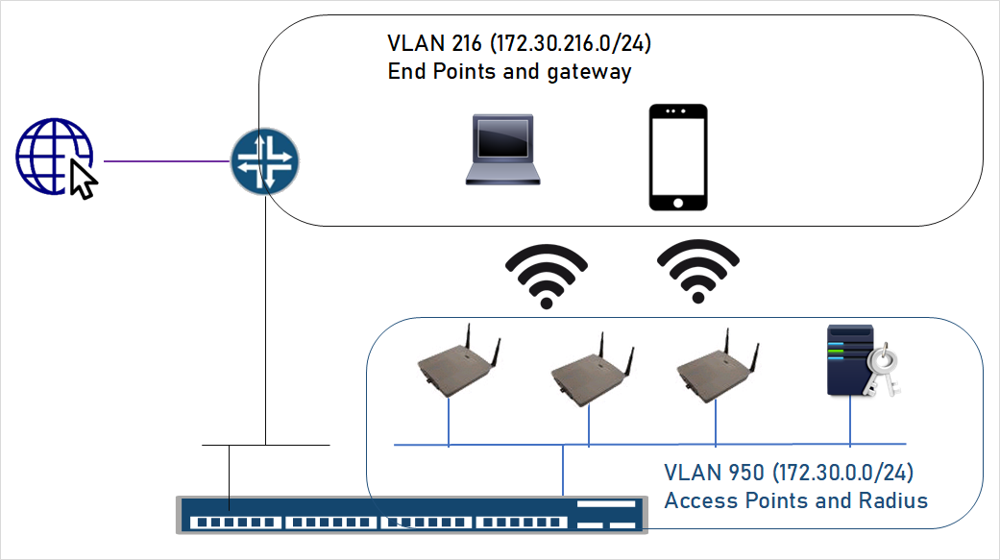

# WPA2 Enterprise Mode with End-of-Life Devices

---

## Hardware and Diagram

| Role | Devices |
|------|---------|
| Switch and WLC controller | Cisco Catalyst 3850 48 ports, PoE, model WS-C3850-48P |
| Wi-Fi Access Point | 4 × Cisco Aironet 1142 connected to ports Gi1/0/13–Gi1/0/16 |
| Radius Server | Raspberry Pi 2 running FreeRADIUS/DaloRADIUS, connected to port Gi1/0/2 |
| Lab Gateway (optional) | Raspberry Pi 5 connected to port Gi1/0/1, acting as a NAT gateway between the lab network and the home Internet connection |

> All Cisco devices are End-of-Life in the vendor catalog, which makes them inexpensive on the second-hand market (eBay), yet they remain robust and reliable when properly configured.  
> Cisco devices were purchased second-hand on eBay for approximately **€100**.


---

## Software Installation

### Addressing Plan

| Name or port | Address | Description |
|--------------|---------|-------------|
| Gi0/0 | 172.16.0.10/24 | Out-of-band Management |
| Vlan 216 | 172.30.216.254/24 | End Point Traffic |
| Vlan 950 | 172.30.0.1/24 | AP management + Radius |

Default router for endpoints: `172.30.216.1` (Pi 5 gateway in lab).  
RADIUS server gets `172.30.0.10` via DHCP.



---

### Catalyst 3850 Software
The last IOS XE release supporting integrated WLC is **16.3.9**.  
This release supports “right-to-use” licensing, with no strict limit on AP count.

---

### RADIUS Server (Raspberry Pi 2)

**DaloRadius** is installed on a Pi2 Raspberry.

#### OS Installation
Install the latest Raspberry Pi OS Lite (no desktop) to save RAM.

Example hardware info:
```bash
uname -a
# Linux DaloRadius 6.12.34+rpt-rpi-v7 #1 SMP Raspbian 1:6.12.34-1+rpt1~bookworm (2025-06-26) armv7l GNU/Linux

cat /sys/firmware/devicetree/base/model
# Raspberry Pi 2 Model B Rev 1.1

free
# total        used        free      shared  buff/cache   available
# Mem:   943132   284392   456296    10340    266780   658740
# Swap:  524284        0   524284
```

DHCP reservation provides static IP: `172.30.0.10`  
Domain: `assoc.space`

---

#### DaloRADIUS Installation
From GitHub:
```bash
wget -qO - https://raw.githubusercontent.com/lirantal/daloradius/master/setup/install.sh | bash
```

At the end, installation details are displayed (DB credentials, admin login).

---

#### Let’s Encrypt Certificate Creation
Without proper RADIUS certificates, users will either get an annoying pop-up or won’t be able to connect at all.

Ensure the RADIUS server is accessible on port 80 with the DNS name `daloradius.assoc.space`:
```bash
sudo certbot certonly --standalone -d daloradius.assoc.space
sudo chown freerad:root /etc/letsencrypt/archive/daloradius.assoc.space/*.pem
```

Update `/etc/freeradius/3.0/mods-enabled/eap`:
```text
eap {
   tls-config tls-common {
       private_key_file = /etc/letsencrypt/live/daloradius.assoc.space/privkey.pem
       certificate_file = /etc/letsencrypt/live/daloradius.assoc.space/fullchain.pem
       ca_file = /etc/letsencrypt/live/daloradius.assoc.space/chain.pem
   }
}
```

---

## Lab Gateway (Raspberry Pi 5)

Lab only – simulates the Internet router.

**NAT for endpoint traffic** when the upstream router lacks static routing:
```bash
iface eth0 inet static
    address 172.30.216.1/24
    up ip route add 172.30.0.0/22 via 172.30.216.254
    up iptables -t nat -A POSTROUTING -o wlan0 ! -d 172.16.0.0/12 -j MASQUERADE
    up iptables -A FORWARD -i eth0 -o wlan0 -j ACCEPT
    up iptables -A FORWARD -i wlan0 -o eth0 -m state --state RELATED,ESTABLISHED -j ACCEPT
```

---

## WLC Configuration Notes

- **Standalone Mode**  
  If part of a stack:  
  ```bash
  switch 3 renumber 1
  reload
  ```

- **Enable Inter-VLAN Routing**  
  ```bash
  conf t
  ip routing
  end
  ```

- **AP Images**  
  Standalone: `C1140-K9W7-M`  
  Lightweight: `C1140-K9W8-M` (required for WLC)

- **WLC Discovery via DHCP Option 43**  
  ```bash
  ip dhcp pool WirelessAP
   network 172.30.0.0 255.255.255.0
   default-router 172.30.0.1
   dns-server 8.8.8.8
   option 43 hex f104.ac1e.00fe
  ```
  Option 43 = `f104` + controller IP in hex.

- **Expired Certificates on AP**  
  ```bash
  crypto pki trustpool policy
   revocation-check none
   match certificate ALLOW_EXPIRED allow expired-certificate
  ```

- **WPA2 Enterprise Configuration**  
  ```bash
  dot1x system-auth-control
  aaa new-model
  aaa group server radius RAD-GRP
    server name DaloRadius
  wlan MySSID 1 MySSID
    accounting-list LTU-DOT1X
    client vlan 216
    security dot1x authentication-list LTU-DOT1X
    no shutdown
  ```

- **Change of Authorization (CoA)**  
  ```bash
  aaa server radius dynamic-author
    client 172.30.0.10 server-key RadiusPwd
    auth-type any
  ```

---

## Final Notes

**Project highlights:**
- Building-wide Wi-Fi coverage with seamless roaming
- WPA2-Enterprise authentication backed by a dedicated FreeRADIUS server
- Total cost: ~€100 using End-of-Life, second-hand equipment
- Stable performance for association needs

Special thanks to *nayarasi* (mrncciew.com) for:
- [Getting Started with 3850](https://mrncciew.com/2013/09/29/getting-started-with-3850/)
- [WLAN Config in 3850 – Part 1](https://mrncciew.com/2013/12/04/wlan-config-in-3850-part-1/)
- [WLAN Config in 3850 – Part 2](https://mrncciew.com/2013/12/06/wlan-config-with-3850-part-2/)

---

## Complete Catalyst 3850 Configuration

```cisco
version 16.3
no service pad
service timestamps debug datetime msec
service timestamps log datetime
service internal
service call-home
platform punt-keepalive disable-kernel-core
!
hostname WLC-Sw3850
!
!
vrf definition Mgmt-vrf
 !
 address-family ipv4
 exit-address-family
 !
 address-family ipv6
 exit-address-family
!
logging buffered 50000
enable password admin
!
aaa new-model
!
!
aaa group server radius RAD-GRP
 server name DaloRadius
!
aaa authentication login default local
aaa authentication dot1x LTU-DOT1X group RAD-GRP
aaa authorization exec default if-authenticated 
aaa authorization network default group RAD-GRP 
aaa accounting dot1x default start-stop group RAD-GRP
aaa accounting dot1x LTU-DOT1X start-stop group RAD-GRP
aaa accounting network LTU-DOT1X start-stop group RAD-GRP
!
!
!
!
!
aaa server radius dynamic-author
 client 172.30.0.10 server-key {{ RadiusPwd }}
 auth-type any
!
aaa session-id common
boot system switch all flash:packages.conf
clock timezone CET 1 0
clock summer-time FR recurring last Sun Mar 2:00 last Sun Oct 2:00
switch 1 provision ws-c3850-48p
!
!
!
!
ip routing
!
!
!
!
!
ip name-server 8.8.8.8
ip dhcp excluded-address 172.30.216.1 172.30.216.12
ip dhcp excluded-address 172.30.0.1 172.30.0.9
!
ip dhcp pool WirelessAP
 network 172.30.0.0 255.255.255.0
 default-router 172.30.0.1 
 dns-server 8.8.8.8 
 option 43 hex f104.ac1e.00fe
!
ip dhcp pool WirelessEndPoints
 network 172.30.216.0 255.255.255.0
 default-router 172.30.216.1 
 dns-server 8.8.8.8 
!
ip dhcp pool P2P-DaloRadius
 host 172.30.0.10 255.255.255.0
 client-identifier 01{{ raspberry mac address ex: b8.27eb.abba.ba }} 
!
!
!
login on-success log
!
!
!
!
!
!
!
epm logging
authentication mac-move permit
!
crypto pki trustpoint SLA-TrustPoint
 enrollment pkcs12
 revocation-check crl
!
crypto pki trustpoint TP-self-signed-XXXXXX
 enrollment selfsigned
 subject-name cn=IOS-Self-Signed-Certificate-
 revocation-check none
 rsakeypair TP-self-signed- XXXXXX
!
crypto pki trustpool policy
 revocation-check none
 match certificate ALLOW_EXPIRED allow expired-certificate
!
!
!
crypto pki certificate map ALLOW_EXPIRED 10
 issuer-name co cisco manufacturing ca
!
crypto pki certificate map ALLOW_EXPIRED 20
 issuer-name co act2 sudi ca
!
crypto pki certificate chain SLA-TrustPoint
 certificate ca 01
 ...

crypto pki certificate chain TP-self-signed-XXXXX
 certificate self-signed 01
 ...
!
dot1x system-auth-control
license boot level ipservicesk9
diagnostic bootup level minimal
spanning-tree mode rapid-pvst
spanning-tree extend system-id
memory free low-watermark processor 79468
!
username cisco privilege 15 password 0 cisco	! LAB only 
!
redundancy
 mode sso
!
!
transceiver type all
 monitoring
!
!
class-map match-any non-client-nrt-class
!
policy-map port_child_policy
 class non-client-nrt-class
  bandwidth remaining ratio 10
policy-map system-cpp-policy
!
! 
!
interface GigabitEthernet0/0
 vrf forwarding Mgmt-vrf
 ip address 172.16.0.10 255.255.255.0
 negotiation auto
!
interface GigabitEthernet1/0/1
 description -- Admin InBand --
 switchport access vlan 216
 switchport mode access
!
interface GigabitEthernet1/0/2
 description -- dedicated port to Radius --
 switchport access vlan 950
 switchport mode access
!
interface GigabitEthernet1/0/3
 ...
!
interface GigabitEthernet1/0/13
 switchport access vlan 950
 switchport mode access
 power efficient-ethernet auto
 spanning-tree portfast
!
interface GigabitEthernet1/0/14
 switchport access vlan 950
 switchport mode access
 power efficient-ethernet auto
 spanning-tree portfast
!
interface GigabitEthernet1/0/15
 switchport access vlan 950
 switchport mode access
 power efficient-ethernet auto
 spanning-tree portfast
!
interface GigabitEthernet1/0/16
 switchport access vlan 950
 switchport mode access
 power efficient-ethernet auto
 spanning-tree portfast
!
interface GigabitEthernet1/0/17
 switchport access vlan 950
 switchport mode access
 power efficient-ethernet auto
 spanning-tree portfast
!
interface GigabitEthernet1/0/18
 ...!
interface Vlan1
 no ip address
 shutdown
!
interface Vlan216
 description -- Wifi End Points --
 ip address 172.30.216.254 255.255.255.0
!
interface Vlan950
 description -- AP management and Radius --
 ip address 172.30.0.1 255.255.255.0
 ip pim sparse-mode
!
ip forward-protocol nd
no ip http server
ip http authentication local
no ip http secure-server
ip route 0.0.0.0 0.0.0.0 172.30.216.1
ip route vrf Mgmt-vrf 0.0.0.0 0.0.0.0 172.16.0.254
ip scp server enable
!

!
ip radius source-interface Vlan950 
!
!
radius server DaloRadius
 address ipv4 172.30.0.10 auth-port 1812 acct-port 1813
 key {{ RadiusPwd }}
!
!
control-plane
 service-policy input system-cpp-policy
!
!
line con 0
 exec-timeout 120 0
 stopbits 1
line aux 0
 stopbits 1
line vty 0 4
 exec-timeout 240 0
 privilege level 15
 logging synchronous
 transport input ssh
 escape-character 5
line vty 5 15
!
ntp source Vlan216
ntp server pool.ntp.org
!
!
wireless mobility controller
wireless management interface Vlan950
wlan WifiSSID 1 WifiSSID
 aaa-override
 accounting-list LTU-DOT1X
 client vlan 216
 security dot1x authentication-list LTU-DOT1X
 no shutdown
ap ntp ip 172.30.0.1
ap country FR
ap dot11 airtime-fairness policy-name Default 0
ap group default-group
ap hyperlocation ble-beacon 0
ap hyperlocation ble-beacon 1
ap hyperlocation ble-beacon 2
ap hyperlocation ble-beacon 3
ap hyperlocation ble-beacon 4
end
```

© 2025 Philippe Jounin
